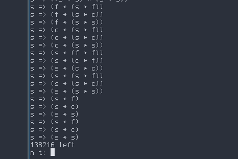
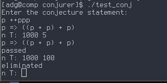

# conjurer
A small program for testing and generating elementary number theory conjectures in bulk.
## How does it work?
The general conjecture statement of a conjurer conjecture is "All naturals of the form A can be written in the form B". 
These forms are represented as expression trees internally. A conjecture is formed by connecting one form to another.

Every line in that image is a conjecture, for example:
s => s * s is equivalent to stating: 

Every perfect square can be written as a multiplication of two perfect squares.
After their construction, conjectures are tested in bulk by the parameters specified by the user.

