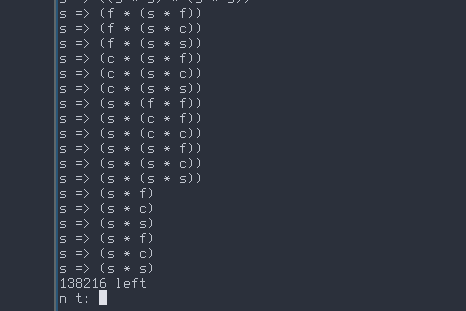
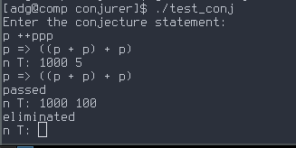

# conjurer
A small program for testing and generating elementary number theory conjectures in bulk.

## Project layout

- `include/` contains public declarations for the core expression, vector, Fibonacci, parser, and conjecture modules.
- `src/` contains the core implementations and the main conjecture generator entry point.
- `tests/` contains interactive test programs for checking conjectures.
- `tools/` contains small utilities for inspecting parsed expressions and generated forms.
- `build/` is created by `make` and contains compiled binaries.

## Building

```sh
make all
```

Useful targets:

- `make run` builds and runs the main generator.
- `make test` builds and runs the interactive conjecture tester.
- `make parse` builds and runs the expression parser utility.
- `make forms` builds and runs the generated forms utility.
- `make clean` removes build artifacts.

## How does it work?
The general conjecture statement of a conjurer conjecture is "All naturals of the form A can be written in the form B". 
These forms are represented as expression trees internally. A conjecture is formed by connecting one form to another.



Every line in that image is a conjecture, for example:
s => s * s is equivalent to stating: 

"Every perfect square can be written as a multiplication of two perfect squares."

After their construction, conjecture candidates are tested in bulk by the parameters specified by the user.


